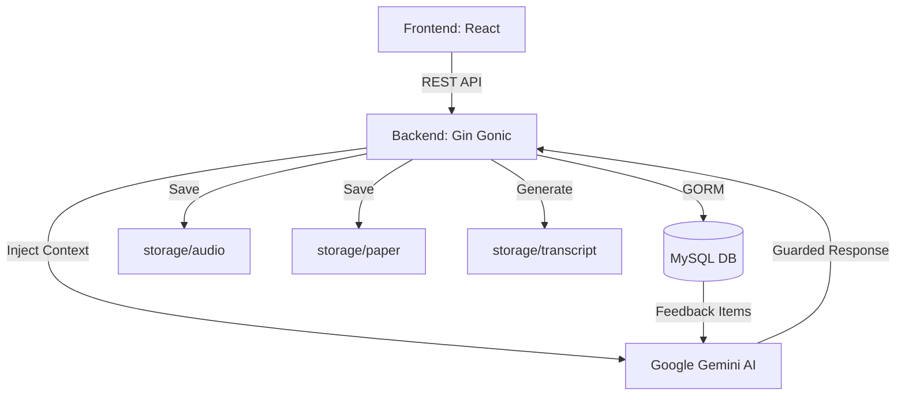

# 🛡️ TierLog — Intelligent Thesis Supervision System

> **AI-Powered E-Logbook & Revision Assistant**
>
> Built with high-performance Go (Gin), GORM, and Google Gemini.
> A secure, guided bridge between lecturer feedback and student execution.

---

## 📋 Table of Contents
- [✨ Core Features](#-core-features)
- [🏗️ System Architecture](#-system-architecture)
- [📂 Folder Structure](#-folder-structure)
- [🗄️ Database Schema](#-database-schema)
- [📡 API Reference](#-api-reference)
  - [Consultation Management](#consultation-management)
  - [Identity Management](#identity-management)
  - [AI Assistance](#ai-assistance)
- [🧪 Testing with Postman (Step-by-Step)](#-testing-with-postman-step-by-step)
- [🚀 Quick Start](#-quick-start)

---

## ✨ Core Features

- **Multi-Format Logbook**: Upload consultation recordings (`.mp3`) and thesis drafts (`.docx`, `.pdf`) in one session.
- **External File Storage**: High-speed disk-based storage for large files (Audio, Papers, Transcripts) with metadata separation.
- **AI-Guarded Assistant**: A custom-tuned Gemini assistant that *refuses* independent suggestions. It only acts upon official lecturer feedback injected from the database.
- **Feedback Lifecycle**: Track supervision points categorized by severity (`Major`/`Minor`) and status (`Pending`/`Fixed`).
- **SPA Integration**: Integrated React frontend serving directly from the Go binary.

---

## 🏗️ System Architecture



---

## 📂 Folder Structure

```
Tier_Log/
├── controller/        # Business logic handlers
│   ├── ai_controller.go           # Gemini AI Integration & Guardrails
│   ├── consultation_controller.go # File upload & log management
│   └── user_controller.go         # Identity & User CRUD
├── models/            # Database entity definitions
│   └── models.go                  # GORM Structs & JSON mappings
├── storage/           # Physical file storage (Excluded from Git)
│   ├── audio/                     # .mp3 Consultation recordings
│   ├── paper/                     # .docx/.pdf Thesis drafts
│   └── transcript/                # .txt Placeholder transcripts
├── dist/              # Compiled Frontend (SPA)
├── main.go            # Entry point & Route registration
└── struct_go.sql      # Database initialization script
```

---

## 🗄️ Database Schema

| Table | Description |
| :--- | :--- |
| **`users`** | Authentication & RBAC (`student` or `lecturer`). |
| **`lecturers`** | Extended profile for faculty members. |
| **`students`** | Profile including thesis title and supervisor link. |
| **`consultation_logs`** | Core session links for audio, paper, and transcript files. |
| **`feedback_items`** | Atomic feedback points (Major/Minor) linked to a log. |

---

## 📡 API Reference

### Consultation Management

#### **POST** `/api/consultation`
Upload a new consultation session.
- **Body**: `multipart/form-data`
- **Fields**:
  - `user_id`: (Integer) Student ID
  - `audio`: (File) Recording (.mp3)
  - `paper`: (File, Optional) Thesis draft (.docx, etc.)

#### **GET** `/api/consultation`
Retrieve all consultation logs with nested feedback items.

---

### Identity Management

| Method | Endpoint | Description |
| :--- | :--- | :--- |
| **POST** | `/users` | Register a new system user. |
| **POST** | `/lecturers` | Create a lecturer profile. |
| **POST** | `/students` | Create a student profile & link to supervisor. |
| **GET** | `/students` | List all students with lecturer preloading. |

---

### AI Assistance

#### **POST** `/api/ai/assist`
Interact with the Guarded AI Assistant.
- **Body**: `application/json`
- **Parameters**:
  ```json
  {
    "log_id": 1,
    "query": "How do I fix the methodology based on the feedback?"
  }
  ```
- **Constraint**: Returns **403 Forbidden** if no lecturer feedback has been recorded for the log.

---

## 🧪 Testing with Postman (Step-by-Step)

To test the **AI-Guarded Persona Workflow**, follow ini set-up urutan di Postman:

### 1. Account Setup (Lakukan secara berurutan)
- **Buat Akun User**: `POST http://localhost:8080/users`
  ```json
  { "email": "mhs1@uni.ac.id", "password": "password123", "role": "student" }
  ```
- **Buat Profil Dosen**: `POST http://localhost:8080/lecturers`
  ```json
  { "user_id": 1, "nip": "199001", "name": "Dr. Arsitek", "faculty": "Teknik Informatika" }
  ```
- **Buat Profil Mahasiswa**: `POST http://localhost:8080/students`
  ```json
  { "user_id": 2, "lecturer_id": 1, "nim": "22001", "name": "Budi", "prodi": "Informatika", "thesis_title": "Implementasi AI" }
  ```

### 2. Alur AI-Guarded Persona (Fitur Utama)
- **Method**: `POST`
- **URL**: `http://localhost:8080/api/consultation`
- **Body**: `form-data`
- **Keys**:
  - `user_id`: `2` (Gunakan ID mahasiswa yang baru dibuat)
  - `audio`: [Upload file .mp3]
  - `paper`: [Upload file .docx] (**WAJIB** untuk analisis AI)
- **Cara Kerja**:
  - Sistem akan menyimpan file, membaca isi dokumen `.docx`, dan mengirimkannya ke **Gemini API**.
  - Gemini akan menganalisis dokumen tersebut terhadap transkrip bimbingan (simulasi) dan secara otomatis memasukkan poin-poin revisi ke tabel `feedback_items`.

### 3. Verifikasi Hasil Analisis AI
- **Method**: `GET`
- **URL**: `http://localhost:8080/api/consultation`
- **Output**: Periksa field `feedback_items`. Anda akan melihat daftar tugas revisi yang dikategorikan sebagai **Major (HOC)** atau **Minor (LOC)** yang dibuat otomatis oleh AI.

### 4. Interactive AI Assistance
- **Method**: `POST`
- **URL**: `http://localhost:8080/api/ai/assist`
- **Body (JSON)**:
  ```json
  { 
    "log_id": 1, 
    "query": "Bagaimana cara saya memperbaiki metodologi sesuai arahan dosen tadi?" 
  }
  ```
- **Prinsip Guarded**:
  - AI akan membalas dengan **Persona Dosen**.
  - Jika `log_id` tersebut tidak memiliki feedback (misal proses analisis gagal atau draf tidak diupload), AI akan membalas dengan **403 Forbidden** sesuai aturan keamanan akademik.

---

## 🚀 Quick Start

1. **Clone & Install Dependencies**
   ```bash
   git clone <repository_url>
   cd Tier_Log
   go mod tidy
   ```

2. **Configure Database**
   - Import `struct_go.sql` into your MySQL server.
   - Update `koneksi/koneksi.go` credentials if needed.

3. **Set Environment Variables**
   ```bash
   export GEMINI_API_KEY="your_api_key_here"
   ```

4. **Run**
   ```bash
   go run main.go
   ```
   *The system handles folder creation and DB migration automatically.*

---

*TierLog — Bridging the gap between feedback and excellence.*
