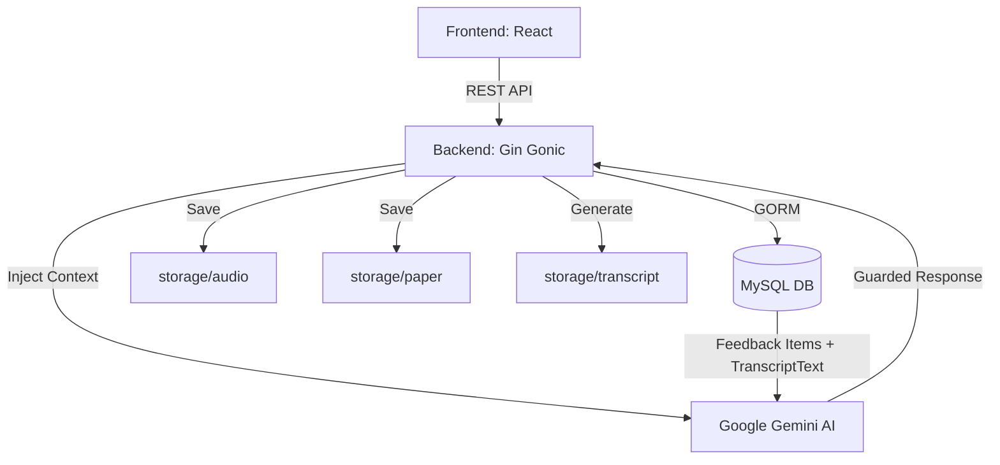
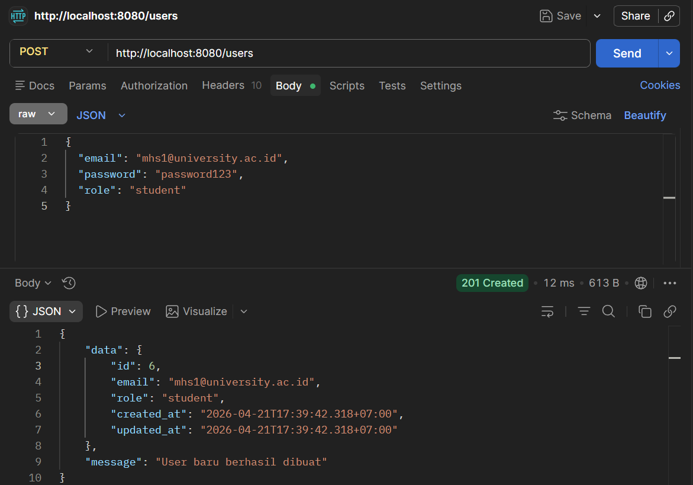
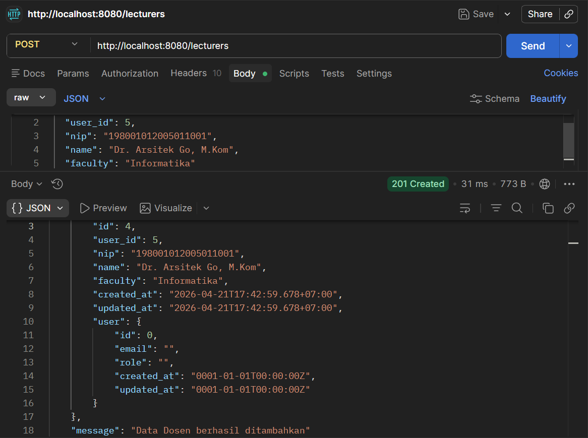
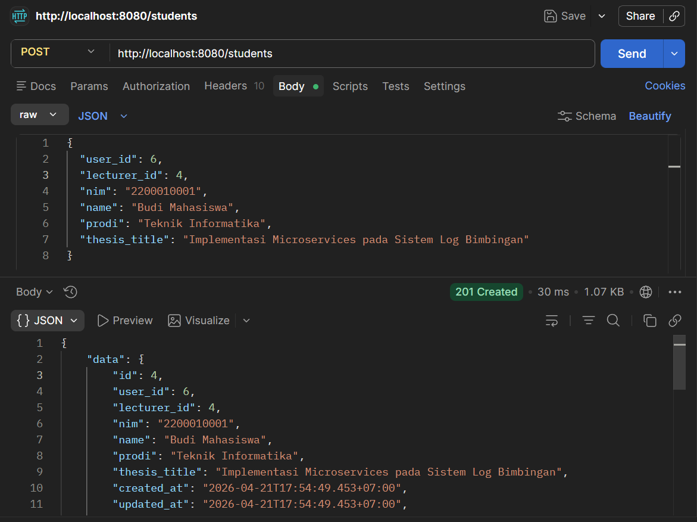
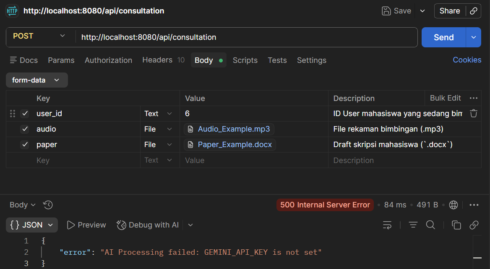
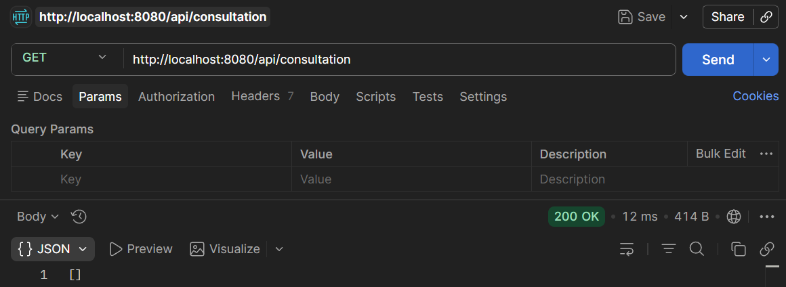
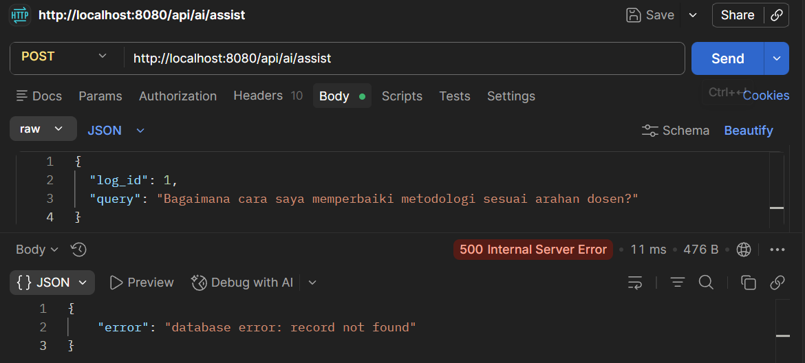

# 🛡️ TierLog — Intelligent Thesis Supervision System

> **AI-Powered E-Logbook & Revision Assistant**
>
> Built with high-performance Go (Gin), GORM, and Google Gemini.
> A secure, guided bridge between lecturer feedback and student execution.

---

## 📋 Table of Contents
- [✨ Core Features](#-core-features)
- [🏗️ System Architecture](#-system-architecture)
- [📂 Folder Structure](#-folder-structure)
- [🗄️ Database Schema](#-database-schema)
- [📡 API Reference](#-api-reference)
  - [1. Identity Management — Users](#1-identity-management--users)
  - [2. Identity Management — Lecturers](#2-identity-management--lecturers)
  - [3. Identity Management — Students](#3-identity-management--students)
  - [4. Consultation Management](#4-consultation-management)
  - [5. AI Assistance (Guarded)](#5-ai-assistance-guarded)
- [🚀 Quick Start](#-quick-start)

---

## ✨ Core Features

- **Multi-Format Logbook**: Upload consultation recordings (`.mp3`) and thesis drafts (`.docx`) in one session.
- **External File Storage**: Disk-based storage for large files (Audio, Papers, Transcripts) with metadata saved to DB.
- **AI-Guarded Assistant**: A custom-tuned Gemini assistant that *refuses* independent suggestions — only responds based on official lecturer feedback.
- **Feedback Lifecycle**: Track supervision points categorized by severity (`Major`/`Minor`) and status (`Pending`/`Fixed`).
- **SPA Integration**: Integrated React frontend serving directly from the Go binary.

---

## 🏗️ System Architecture



---

## 📂 Folder Structure

```
Tier_Log/
├── controller/        # Business logic handlers
│   ├── ai_controller.go           # Gemini AI Integration & Guardrails
│   ├── consultation_controller.go # File upload & log management
│   └── user_controller.go         # Identity & User CRUD
├── models/            # Database entity definitions
│   └── models.go                  # GORM Structs & JSON mappings
├── storage/           # Physical file storage (Excluded from Git)
│   ├── audio/                     # .mp3 Consultation recordings
│   ├── paper/                     # .docx Thesis drafts
│   └── transcript/                # .txt Placeholder transcripts
├── screenshoot/       # API documentation screenshots
├── dist/              # Compiled Frontend (SPA)
├── main.go            # Entry point & Route registration
└── struct_go.sql      # Database initialization script
```

---

## 🗄️ Database Schema

| Table | Description |
| :--- | :--- |
| **`users`** | Authentication & RBAC (`student` or `lecturer`). Supports soft delete. |
| **`lecturers`** | Extended profile for faculty members. |
| **`students`** | Profile including thesis title and supervisor link (`lecturer_id`). |
| **`consultation_logs`** | Core session linked to `student_id`, stores file references and `transcript_text` for AI context. |
| **`feedback_items`** | Atomic feedback points (Major/Minor) with lifecycle status (Pending/Fixed). |

---

## 📡 API Reference

### 1. Identity Management — Users

#### **POST** `/users`
Membuat akun pengguna baru (dosen atau mahasiswa).

- **URL**: `http://localhost:8080/users`
- **Method**: `POST`
- **Content-Type**: `application/json`

**Parameter Body (JSON)**:

| Field | Type | Required | Description |
|:---|:---|:---|:---|
| `email` | `string` | ✅ Ya | Alamat email unik pengguna |
| `password` | `string` | ✅ Ya | Password pengguna |
| `role` | `string` | ✅ Ya | Peran pengguna: `student` atau `lecturer` |

**Contoh Request**:
```json
{
  "email": "mhs1@university.ac.id",
  "password": "password123",
  "role": "student"
}
```

**Contoh Response** `201 Created`:
```json
{
  "data": {
    "id": 6,
    "email": "mhs1@university.ac.id",
    "role": "student",
    "created_at": "2026-04-15T08:30:00Z",
    "updated_at": "2026-04-15T08:30:00Z"
  },
  "message": "User baru berhasil dibuat"
}
```

**Screenshot Postman**:



---

#### **GET** `/users`
Mengambil semua data pengguna.

- **URL**: `http://localhost:8080/users`
- **Method**: `GET`
- **Tidak memerlukan body**

---

### 2. Identity Management — Lecturers

#### **POST** `/lecturers`
Membuat profil dosen. **Wajib dilakukan setelah membuat User dengan `role: lecturer`**.

- **URL**: `http://localhost:8080/lecturers`
- **Method**: `POST`
- **Content-Type**: `application/json`

**Parameter Body (JSON)**:

| Field | Type | Required | Description |
|:---|:---|:---|:---|
| `user_id` | `integer` | ✅ Ya | ID dari tabel `users` dengan role `lecturer` |
| `nip` | `string` | ✅ Ya | NIP dosen (unik, maks. 20 karakter) |
| `name` | `string` | ✅ Ya | Nama lengkap dosen |
| `faculty` | `string` | ❌ Opsional | Nama fakultas |

**Contoh Request**:
```json
{
  "user_id": 5,
  "nip": "198001012005011001",
  "name": "Dr. Arsitek Go, M.Kom",
  "faculty": "Informatika"
}
```

**Contoh Response** `201 Created`:
```json
{
  "data": {
    "id": 4,
    "user_id": 5,
    "nip": "198001012005011001",
    "name": "Dr. Arsitek Go, M.Kom",
    "faculty": "Informatika"
  },
  "message": "Data Dosen berhasil ditambahkan"
}
```

**Screenshot Postman**:



---

#### **GET** `/lecturers`
Mengambil semua data dosen beserta akun user terkait.

- **URL**: `http://localhost:8080/lecturers`
- **Method**: `GET`

---

### 3. Identity Management — Students

#### **POST** `/students`
Membuat profil mahasiswa dan menghubungkan ke dosen pembimbing.

- **URL**: `http://localhost:8080/students`
- **Method**: `POST`
- **Content-Type**: `application/json`

**Parameter Body (JSON)**:

| Field | Type | Required | Description |
|:---|:---|:---|:---|
| `user_id` | `integer` | ✅ Ya | ID dari tabel `users` dengan role `student` |
| `lecturer_id` | `integer` | ✅ Ya | ID dari tabel `lecturers` (Dosen Pembimbing) |
| `nim` | `string` | ✅ Ya | NIM mahasiswa (unik, maks. 20 karakter) |
| `name` | `string` | ✅ Ya | Nama lengkap mahasiswa |
| `prodi` | `string` | ❌ Opsional | Program studi |
| `thesis_title` | `string` | ❌ Opsional | Judul skripsi/tesis |

**Contoh Request**:
```json
{
  "user_id": 6,
  "lecturer_id": 4,
  "nim": "2200010001",
  "name": "Budi Mahasiswa",
  "prodi": "Teknik Informatika",
  "thesis_title": "Implementasi Microservices pada Sistem Log Bimbingan"
}
```

**Contoh Response** `201 Created`:
```json
{
  "data": {
    "id": 4,
    "user_id": 6,
    "lecturer_id": 4,
    "nim": "2200010001",
    "name": "Budi Mahasiswa",
    "prodi": "Teknik Informatika",
    "thesis_title": "Implementasi Microservices pada Sistem Log Bimbingan"
  },
  "message": "Data Mahasiswa berhasil ditambahkan"
}
```

**Screenshot Postman**:



---

#### **GET** `/students`
Mengambil semua data mahasiswa beserta dosen pembimbing dan akun user.

- **URL**: `http://localhost:8080/students`
- **Method**: `GET`

---

### 4. Consultation Management

#### **POST** `/api/consultation`
Membuat sesi bimbingan baru. Endpoint ini akan otomatis:
1. Menyimpan file audio & paper ke disk.
2. Mengirim isi dokumen `.docx` ke **Gemini AI**.
3. Mengekstrak poin-poin revisi dari transkrip dan menyimpannya sebagai `feedback_items`.

- **URL**: `http://localhost:8080/api/consultation`
- **Method**: `POST`
- **Content-Type**: `multipart/form-data`

**Parameter Form-Data**:

| Field | Type | Required | Description |
|:---|:---|:---|:---|
| `user_id` | `text` | ✅ Ya | ID User mahasiswa yang sedang bimbingan |
| `audio` | `file` | ✅ Ya | File rekaman bimbingan (`.mp3`) |
| `paper` | `file` | ✅ Ya | Draft skripsi mahasiswa (`.docx`) — **digunakan sebagai konteks analisis AI** |

**Contoh Response** `201 Created`:
```json
{
  "message": "Consultation log and AI feedback created successfully",
  "data": {
    "id": 1,
    "student_id": 1,
    "audio_filename": "1776217800_recording.mp3",
    "transcript_filename": "1776217800_transcript.txt",
    "transcript_text": "Dosen: Judulnya sudah oke, tapi metodologinya kurang jelas...",
    "paper_filename": "1776217800_thesis_draft.docx",
    "feedback_items": [
      { "id": 1, "log_id": 1, "content": "Perjelas metodologi di Bab 3", "category": "Major", "status": "Pending" },
      { "id": 2, "log_id": 1, "content": "Perbaiki typo di daftar pustaka", "category": "Minor", "status": "Pending" }
    ]
  }
}
```

**Screenshot Postman [belum buat API Key Gemini]**:



---

#### **GET** `/api/consultation`
Mengambil semua log bimbingan beserta feedback items dan profil mahasiswa.

- **URL**: `http://localhost:8080/api/consultation`
- **Method**: `GET`
- **Tidak memerlukan body**

**Screenshot Postman[kosong karena tidak ada data dari langkah sebelumnya]**:



---

### 5. AI Assistance (Guarded)

#### **POST** `/api/ai/assist`
Berinteraksi dengan AI Assistant. AI **hanya akan merespons** berdasarkan feedback resmi dosen yang sudah tersimpan di database untuk log tersebut.

- **URL**: `http://localhost:8080/api/ai/assist`
- **Method**: `POST`
- **Content-Type**: `application/json`

**Parameter Body (JSON)**:

| Field | Type | Required | Description |
|:---|:---|:---|:---|
| `log_id` | `integer` | ✅ Ya | ID dari `consultation_logs` yang memiliki feedback |
| `query` | `string` | ✅ Ya | Pertanyaan mahasiswa terkait revisi |

**Contoh Request**:
```json
{
  "log_id": 1,
  "query": "Bagaimana cara saya memperbaiki metodologi sesuai arahan dosen?"
}
```

**Contoh Response** `200 OK`:
```json
{
  "status": "success",
  "ai_response": "Berdasarkan feedback dosen pembimbing Anda, berikut panduan konkret memperbaiki Bab 3:\n\n1. **Perjelas Desain Penelitian**: Tambahkan sub-bab yang menjelaskan pendekatan penelitian secara eksplisit...\n2. **Tambahkan Diagram Alur**: Buat flowchart yang menggambarkan proses pengumpulan dan analisis data."
}
```

**Kasus Guarded — `403 Forbidden`** (jika `log_id` tidak memiliki feedback):
```json
{
  "status": "guarded",
  "message": "GUARDED: Belum ada feedback resmi. Selesaikan proses bimbingan terlebih dahulu."
}
```

**Screenshot Postman**:



> **Catatan**: Error karena Langkah sebelumnya gagal memasukkan data.

---

## 🚀 Quick Start

1. **Clone & Install Dependencies**
   ```bash
   git clone https://github.com/cruzhgggggg-coder/Tier_Log.git
   cd Tier_Log
   go mod tidy
   ```

2. **Configure Database**
   - Import `struct_go.sql` ke MySQL Anda.
   - Update kredensial di `koneksi/koneksi.go` jika perlu.

3. **Set Environment Variables**
   ```bash
   # Windows PowerShell
   $env:GEMINI_API_KEY = "your_api_key_here"

   # Linux / macOS
   export GEMINI_API_KEY="your_api_key_here"
   ```

4. **Run**
   ```bash
   go run main.go
   ```
   *Sistem otomatis membuat folder storage dan menjalankan DB migration.*

5. **Akses**
   - **Frontend**: `http://localhost:8080`
   - **API Base**: `http://localhost:8080/api`

---

### 📋 Urutan Setup yang Benar (First Time)

```
1. POST /users         → Buat akun Dosen (role: lecturer)
2. POST /users         → Buat akun Mahasiswa (role: student)
3. POST /lecturers     → Buat profil Dosen (gunakan user_id dari step 1)
4. POST /students      → Buat profil Mahasiswa (gunakan user_id step 2, lecturer_id step 3)
5. POST /api/consultation → Upload rekaman & draft (gunakan user_id mahasiswa)
6. POST /api/ai/assist → Tanya AI (gunakan log_id dari hasil step 5)
```

---

*TierLog — Bridging the gap between feedback and excellence.*
